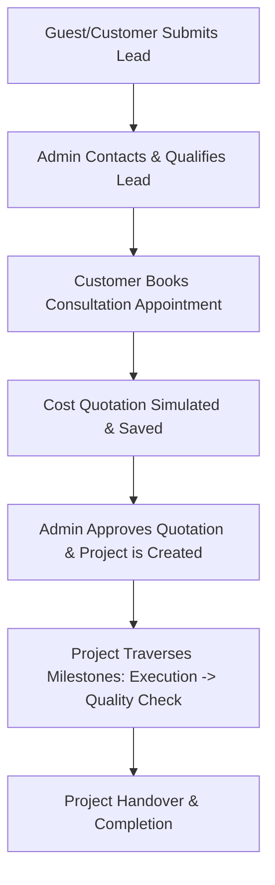

# Crescent Chique Designs SaaS Backend

Crescent Chique Designs is a premium Software-as-a-Service (SaaS) platform tailored for high-end boutique interior design and renovation execution. The backend is built using the Flask web application framework, SQLAlchemy ORM, and MySQL, structured using the Application Factory and Service-Layer architectural patterns.

---

## 1. Project Overview

### 1.1 Purpose
The platform automates the end-to-end operational lifecycle of premium interior design projects, from initial client consultation and cost estimation to construction milestones and final handover.

### 1.2 User Roles
- **Customers**: Registered clients who can view design catalogs, schedule consultation slots, simulate and save cost quotations, track project progress, upload spatial specifications (PDFs/Images), submit custom inquiry leads, and view platform alerts.
- **Administrators**: System owners who manage incoming inquiries, update consultation bookings, adjust project progress percentages/statuses, manage database objects (soft delete and restore), and monitor platform-wide operational statistics.

### 1.3 Business Workflow


---

## 2. Features

- **Authentication & Authorization**: Secure, stateful session cookie tracking via Flask-Login with role-based restriction controls (Admin vs. Customer).
- **Design Portfolio**: A gallery catalog database filterable by styles (e.g., Scandinavian, Industrial) and room layouts.
- **Appointment Scheduling**: Interactive slots reservation with past-date checks and Admin confirmation.
- **Quotation Cost Engine**: On-the-fly cost estimation calculators and persistent quotation storage utilizing tier-based pricing (Economy, Premium, Luxury).
- **Project Progress Tracking**: Dynamic renovation milestones tracking (Lead Created -> Completed) with progress percentages (0-100%).
- **Notifications & Alerts**: Customer notifications system tracking read/unread alerts.
- **Secure File Uploads**: Clamped to 10MB limits, validating files extension types (`.pdf`, `.png`, `.jpg`, `.jpeg`).
- **Lead Management**: Lead capture tracking qualified states (`new`, `contacted`, `qualified`, `lost`).
- **Dashboard Analytics**: Efficient, aggregate database analytics summaries for customers and admins.
- **Universal Search & Pagination**: Standard query parameters filtering (`page`, `per_page`, search terms) across all listing APIs.
- **Soft Delete & Recovery**: Reusable model restoration layer filtering soft-deleted entries (`is_deleted=True`) by default.

---

## 3. Tech Stack

- **Backend**: Python 3.12, Flask, SQLAlchemy ORM, Flask-Login, Flask-Migrate
- **Database**: MySQL 8.0, PyMySQL
- **Tools**: Postman, Git, GitHub

---

## 4. Architecture

The backend implements the **Application Factory** and **Service Layer** design patterns to decouple route control handlers from business logic and database persistence:

- **Blueprints (Controllers)**: Declare routes, parse query string parameters, enforce cookie session roles, and return JSON payloads.
- **Services (Business Logic)**: Houses validation checks, formula calculators, and database aggregate calculations.
- **Models (Database)**: Declarative SQLAlchemy entities inheriting from `UUIDBase` which provides auto-generated UUID primary keys and soft delete attributes.

### Folder Structure
```
crescent-chique-designs/
│
├── run.py                     # Application entrypoint
├── config.py                  # Environment-specific settings
├── requirements.txt           # Dependency manifest
├── migrations/                # Alembic database migration files
├── docs/                      # QA checklists and API documentations
│
└── app/
    ├── __init__.py            # Flask Application Factory constructor
    ├── extensions.py          # Extensions manager (DB, login, migrations)
    ├── models.py              # Declarative SQLAlchemy ORM models
    │
    ├── blueprints/            # Route controllers
    │   ├── auth.py
    │   ├── appointments.py
    │   ├── dashboard.py
    │   ├── files.py
    │   ├── leads.py
    │   ├── projects.py
    │   └── quotations.py
    │
    └── services/              # Business logic & validation layers
        ├── appointment_service.py
        ├── dashboard_service.py
        ├── file_service.py
        ├── lead_service.py
        ├── project_service.py
        ├── quotation_service.py
        └── soft_delete_service.py
```

---

## 5. Installation Guide

### Prerequisites
- Python 3.12+ installed.
- MySQL 8.0+ service running locally.

### Setup Steps
1. Clone the repository:
   ```bash
   git clone https://github.com/jaisveenkaur/CrescentChiqueDesigns.git
   cd CrescentChiqueDesigns
   ```

2. Initialize virtual environment:
   ```bash
   python -m venv .venv
   source .venv/bin/activate
   ```

3. Install requirements:
   ```bash
   pip install -r requirements.txt
   ```

4. Configure environment settings:
   Copy `.env.example` to `.env` and adjust database variables:
   ```env
   FLASK_ENV=development
   DATABASE_URL=mysql+pymysql://<user>:<password>@localhost:3306/crescent_chique
   SECRET_KEY=your-session-secret-key
   ```

---

## 6. Database Setup

1. Run Alembic migrations to construct the database schema:
   ```bash
   flask db upgrade
   ```

2. Seed the database with default administrative profiles, portfolio designs, and sample operations records:
   ```bash
   python scripts/seed_db.py
   ```

---

## 7. Running the Application

Start the Flask built-in development server:
```bash
flask run --port 5000
```
The application will bind to `http://127.0.0.1:5000/`. You can query the health endpoint `/` to confirm connectivity:
```json
{
  "status": "running",
  "application": "Crescent Chique Designs",
  "database": "connected"
}
```

---

## 8. API Endpoints Overview

For detailed request/response payload examples, refer to [API_DOCUMENTATION.md](file:///Users/jaisveenkaur/Desktop/Projects/Crescent%20Chique%20Designs/docs/API_DOCUMENTATION.md).

| Module | Method | Endpoint | Description | Authorization |
| :--- | :--- | :--- | :--- | :--- |
| **Auth** | `POST` | `/api/v1/auth/register` | Registers customer profile | Public |
| | `POST` | `/api/v1/auth/login` | Login user session | Public |
| | `POST` | `/api/v1/auth/logout` | Logout user session | Authenticated |
| | `GET` | `/api/v1/auth/profile` | Retrieve profile metadata | Authenticated |
| | `PUT` | `/api/v1/auth/profile` | Update profile metadata details | Authenticated |
| **Designs** | `GET` | `/api/v1/designs` | Lists design portfolio | Public |
| | `GET` | `/api/v1/designs/<id>` | Get design specifications | Public |
| | `POST` | `/api/v1/designs` | Create design entry | Admin |
| | `PUT` | `/api/v1/designs/<id>` | Update design details | Admin |
| | `DELETE` | `/api/v1/designs/<id>` | Soft delete design entry | Admin |
| **Appointments** | `POST` | `/api/v1/appointments` | Book consultation slot | Customer |
| | `GET` | `/api/v1/appointments` | Lists appointments (Paginated) | Customer / Admin |
| | `PUT` | `/api/v1/appointments/<id>/status` | Update booking status | Admin |
| | `DELETE` | `/api/v1/appointments/<id>` | Soft cancel slot booking | Owner / Admin |
| **Quotations** | `POST` | `/api/v1/quotations/generate` | On-the-fly cost calculation | Public |
| | `POST` | `/api/v1/quotations` | Create and save quotation | Customer |
| | `GET` | `/api/v1/quotations` | Lists quotations (Paginated) | Customer / Admin |
| | `DELETE` | `/api/v1/quotations/<id>` | Soft delete quotation | Admin |
| | `PUT` | `/api/v1/quotations/<id>/restore`| Restore quotation | Admin |
| **Projects** | `GET` | `/api/v1/projects` | Lists projects (Paginated) | Customer / Admin |
| | `PUT` | `/api/v1/projects/<id>/status` | Update progress & milestones | Admin |
| | `DELETE` | `/api/v1/projects/<id>` | Soft delete project tracker | Admin |
| | `PUT` | `/api/v1/projects/<id>/restore` | Restore project tracker | Admin |
| **Notifications** | `GET` | `/api/v1/notifications` | Lists client alerts | Customer |
| | `GET` | `/api/v1/notifications/<id>` | Get notification details | Customer |
| | `PUT` | `/api/v1/notifications/<id>/read`| Mark alert as read | Customer |
| **Files** | `POST` | `/api/v1/files/upload` | Upload PDF/image specifications | Customer |
| | `GET` | `/api/v1/files` | Lists files metadata (Paginated) | Customer / Admin |
| | `DELETE` | `/api/v1/files/<id>` | Soft delete file record | Admin |
| | `PUT` | `/api/v1/files/<id>/restore` | Restore file record | Admin |
| **Leads** | `POST` | `/api/v1/leads` | Submit custom lead inquiry | Customer |
| | `GET` | `/api/v1/leads` | Lists system leads (Paginated) | Customer / Admin |
| | `PUT` | `/api/v1/leads/<id>/status` | Modify inquiry status state | Admin |
| | `DELETE` | `/api/v1/leads/<id>` | Soft delete lead record | Admin |
| | `PUT` | `/api/v1/leads/<id>/restore` | Restore lead record | Admin |
| **Dashboard** | `GET` | `/api/v1/dashboard/admin` | Administrative statistics | Admin |
| | `GET` | `/api/v1/dashboard/customer` | Customer metrics overview | Customer |

---

## 9. Testing

The entire backend API can be validated using the structured Postman collection sequences.
To run manual and verification checks:
1. Ensure the database is loaded with fresh seed records (`python scripts/seed_db.py`).
2. Run tests to evaluate session authentication, invalid payload checks, pagination boundary clamps, and soft delete recovery rules.
3. Refer to [QA_CHECKLIST.md](file:///Users/jaisveenkaur/Desktop/Projects/Crescent%20Chique%20Designs/docs/QA_CHECKLIST.md) for step-by-step payloads, negative test boundaries, and SQL verification queries.

---

## 10. Future Enhancements

- **Email Notifications**: Integration with SMTP/SendGrid to push transaction emails automatically when a project transitions milestones.
- **PDF Export Engine**: Generate print-ready formatted PDFs for quotations.
- **Frontend SPA Dashboard**: React or Vue based single page application linking client widgets to these JSON endpoints.
- **Containerized Deployment**: Docker compose blueprints for quick service orchestrations in production (ECS/Kubernetes).
