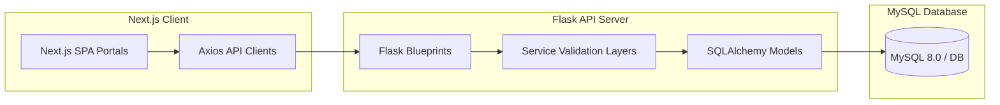

# Crescent Chique Designs — Full-Stack Interior Design SaaS Portal

Crescent Chique Designs is a premium full-stack Software-as-a-Service (SaaS) application tailored for high-end boutique interior design studios. The platform automates the end-to-end client engagement and renovation execution lifecycle, from custom lead generation and consultation bookings to cost calculations, contract approvals, invoice downloads, and visual project milestone tracking.

---

## 1. Project Architecture

The application is split into two major decoupled layers communicating via structured REST APIs:



- **Frontend Portal**: Built with Next.js 16 (App Router), React 19, Framer Motion, and TailwindCSS. It provides sleek, glassmorphic client dashboards and CRM analytics controls for administrators.
- **Backend Service**: Built on Python 3.12, Flask, and SQLAlchemy. It implements the **Application Factory** and **Service-Layer** patterns to isolate business rules from endpoint routing.
- **Database Storage**: Local/production MySQL database instance managing relationships between customers, leads, appointments, projects, quotations, notifications, and system audit logs.

---

## 2. Directory Structure

```
Crescent Chique Designs/
│
├── run.py                     # Backend application entrypoint (Flask)
├── config.py                  # Environment-specific settings
├── requirements.txt           # Python dependency manifest
├── DEPLOYMENT.md              # Production deployment & rollback guide
├── PRODUCTION_CHECKLIST.md    # Pre-deployment validation verification list
├── LOGIN_CREDENTIALS.md       # Pre-seeded test credentials overview
│
├── app/                       # Flask application modules
│   ├── __init__.py            # Flask App Factory initialization
│   ├── extensions.py          # SQLAlchemy, Migrate, Login, and Mail setup
│   ├── models.py              # Declarative SQLAlchemy ORM database models
│   ├── blueprints/            # REST API endpoints & route controllers
│   └── services/              # Business logic, cost calculations, & mailers
│
├── scripts/                   # Seeding, cleanup, and database backup utilities
│   ├── backup_db.sh           # MySQL gzip database compression backups
│   └── seed_realistic_data.py # Demo database population utility
│
└── frontend/                  # Next.js frontend portal app
    ├── package.json           # Node modules & execution script mapping
    ├── src/
    │   ├── app/               # Page routing & Layout structures
    │   ├── components/        # Shareable UI widgets (modals, nav, tables)
    │   └── services/          # Client API calls matching backend routes
    └── public/                # Static brand graphics and layout photos
```

---

## 3. Local Installation & Development Setup

### A. Backend Development Service Setup

1. **Initialize Virtual Environment**:
   ```bash
   python3 -m venv .venv
   source .venv/bin/activate
   ```

2. **Install Dependencies**:
   ```bash
   pip install --upgrade pip
   pip install -r requirements.txt
   ```

3. **Configure Environment Parameters**:
   Create a `.env` file in the root directory:
   ```ini
   FLASK_ENV=development
   FLASK_APP=run.py
   SECRET_KEY=your_long_secret_key
   
   # Database configuration
   DB_USER=root
   DB_PASSWORD=your_mysql_password
   DB_HOST=localhost
   DB_PORT=3306
   DB_NAME=crescent_chique_db
   
   # Flask-Mail configuration
   MAIL_SERVER=localhost
   MAIL_PORT=1025
   MAIL_USE_TLS=False
   MAIL_DEFAULT_SENDER=no-reply@crescentchique.com
   ```

4. **Run Database Migrations & Seed Data**:
   Ensure MySQL service is active, and run:
   ```bash
   # Apply schema migrations
   flask db upgrade
   
   # Seed 25 customers, 40 leads, 20 projects, 30 quotations, and related items
   python scripts/seed_realistic_data.py
   ```

5. **Start Flask Server**:
   ```bash
   python run.py
   ```

---

### B. Frontend Portal App Setup

1. **Navigate and Install Node Modules**:
   ```bash
   cd frontend
   npm install
   ```

2. **Configure Client Environment**:
   Create a `frontend/.env.local` configuration file:
   ```ini
   NEXT_PUBLIC_API_URL=your_api_url
   ```

3. **Start Next.js Development Server**:
   ```bash
   npm run dev
   ```

---

## 4. API Modules Summary

| Module | Purpose | Endpoint | Authorization |
| :--- | :--- | :--- | :--- |
| **Auth** | User sessions & updates | `/api/v1/auth/login`, `/logout`, `/profile` | Public / Authenticated |
| **Designs** | Catalog portfolio items | `/api/v1/designs` (GET, POST, PUT, DELETE) | Public / Admin |
| **Appointments**| Booking consultations | `/api/v1/appointments` (POST, GET, PUT, DELETE) | Customer / Admin |
| **Quotations** | Cost calculations & PDFs| `/api/v1/quotations` (POST, GET, DELETE, RESTORE) | Customer / Admin |
| **Projects** | Progress milestones | `/api/v1/projects` (GET, PUT, DELETE, RESTORE) | Customer / Admin |
| **Files** | Upload specification attachments | `/api/v1/files` (POST, GET, DELETE, RESTORE) | Customer / Admin |
| **Leads** | Inquiries pipeline tracking | `/api/v1/leads` (POST, GET, PUT, DELETE, RESTORE) | Customer / Admin |
| **Dashboard** | Metrics aggregates & charts | `/api/v1/dashboard/admin`, `/customer` | Admin / Customer |
| **Audit Logs** | Security access operations logs | `/api/v1/audit-logs` (GET) | Admin |

*For complete API schemas and detailed payload examples, refer to [API_DOCUMENTATION.md](file:///Users/jaisveenkaur/Desktop/Projects/Crescent%20Chique%20Designs/docs/API_DOCUMENTATION.md).*

---

## 5. Seeded Test Credentials

Refer to [LOGIN_CREDENTIALS.md](file:///Users/jaisveenkaur/Desktop/Projects/Crescent%20Chique%20Designs/LOGIN_CREDENTIALS.md) for pre-seeded developer testing account login details:
- **Chief Administrator**: `admin@crescentchique.com`
- **John Doe (Customer)**: `john.doe@gmail.com`

---

## 6. Production Deployment Guides

To prepare, validate, and launch the application onto staging/production servers, please refer to the following checklists:
1. **Deployment Architecture Setup Guide**: [DEPLOYMENT.md](file:///Users/jaisveenkaur/Desktop/Projects/Crescent%20Chique%20Designs/DEPLOYMENT.md)
2. **Pre-Flight Readiness Validation Checklist**: [PRODUCTION_CHECKLIST.md](file:///Users/jaisveenkaur/Desktop/Projects/Crescent%20Chique%20Designs/PRODUCTION_CHECKLIST.md)
